# Broker Architecture Documentation

This document provides a comprehensive overview of the MQTT broker's internal architecture, covering message flow, concurrency patterns, data structures, and component interactions.

## Table of Contents

1. [High-Level Architecture](#high-level-architecture)
2. [Transport Layer](#transport-layer)
3. [Connection Lifecycle](#connection-lifecycle)
4. [Client Structure](#client-structure)
5. [Packet Processing Pipeline](#packet-processing-pipeline)
6. [Message Routing](#message-routing)
7. [Subscription Trie](#subscription-trie)
8. [Session Management](#session-management)
9. [QoS and Inflight Tracking](#qos-and-inflight-tracking)
10. [Retained Messages](#retained-messages)
11. [Hook System](#hook-system)
12. [Concurrency Patterns](#concurrency-patterns)

---

## High-Level Architecture

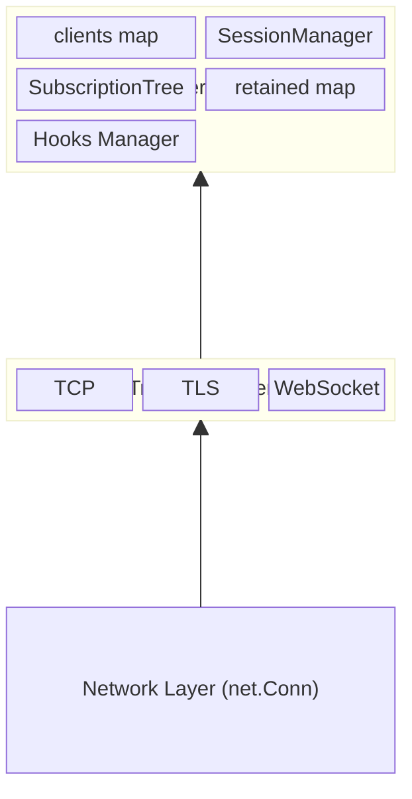

The broker follows a transport-agnostic design where any `net.Conn` implementation can be used. The core broker receives connections from listeners and handles them uniformly regardless of the underlying transport.

---

## Transport Layer

### Listener Types

| Transport | File | Description |
|-----------|------|-------------|
| TCP | `listener.go:20` | Plain TCP listener using `net.Listen` |
| TLS | `listener.go:40` | TLS-encrypted TCP using `tls.Listen` |
| WebSocket | `websocket.go:26` | WebSocket over HTTP/HTTPS with `gorilla/websocket` |

### WebSocket Adapter

WebSocket connections are wrapped in a `wsConn` adapter (`websocket.go:138`) that implements `net.Conn`:

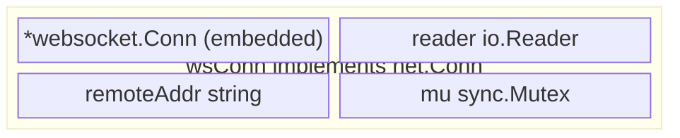

Methods: `Read()` and `Write()` handle binary WebSocket messages transparently.

---

## Connection Lifecycle

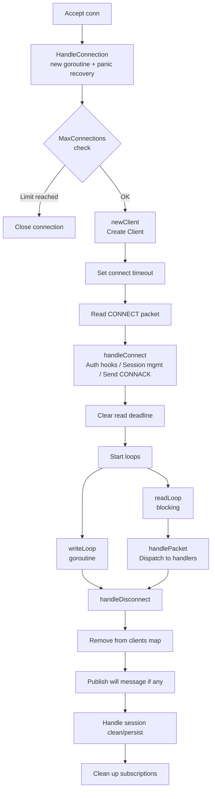

---

## Client Structure

Each connected client is represented by a `Client` struct (`client.go:16`):

| Category | Field | Description |
|----------|-------|-------------|
| **Network** | `conn` | `net.Conn` - underlying connection |
| **Network** | `reader` | `*packet.Reader` - buffered decoder |
| **Identity** | `clientID` | Client identifier from CONNECT |
| **Identity** | `username` | Username from CONNECT |
| **Identity** | `version` | MQTT protocol version |
| **Identity** | `cleanStart` | Clean session flag |
| **Identity** | `keepAlive` | Keep-alive interval |
| **Identity** | `properties` | MQTT 5.0 properties |
| **State** | `connected` | `atomic.Bool` - connection state |
| **State** | `closed` | `atomic.Bool` - prevent double-close |
| **Outbound** | `outbound` | `chan Packet` (cap: 256, non-blocking) |
| **Inflight** | `inFlightOut` | `map[uint16]*inflightMsg` - QoS 1/2 out |
| **Inflight** | `inFlightIn` | `map[uint16]*Publish` - QoS 2 in |
| **Inflight** | `nextPacketID` | `uint16` - packet ID counter |
| **Will** | `will` | `*Publish` - will message |
| **Will** | `willProps` | `*Properties` - will properties |
| **Will** | `willDelay` | `uint32` - will delay interval |
| **Keep-Alive** | `lastActivity` | `time.Time` - for timeout detection |
| **References** | `session` | `*Session` - persistent state |
| **References** | `broker` | `*Broker` - parent broker |
| **References** | `ctx, cancel` | Context for cancellation |

**Mutexes:** `packetIDMu` protects inflight maps and nextPacketID; `keepAliveMu` protects lastActivity

### Client Goroutines

Each client spawns two goroutines after successful CONNECT. Both have panic recovery with stack trace logging to prevent a single client from crashing the broker:

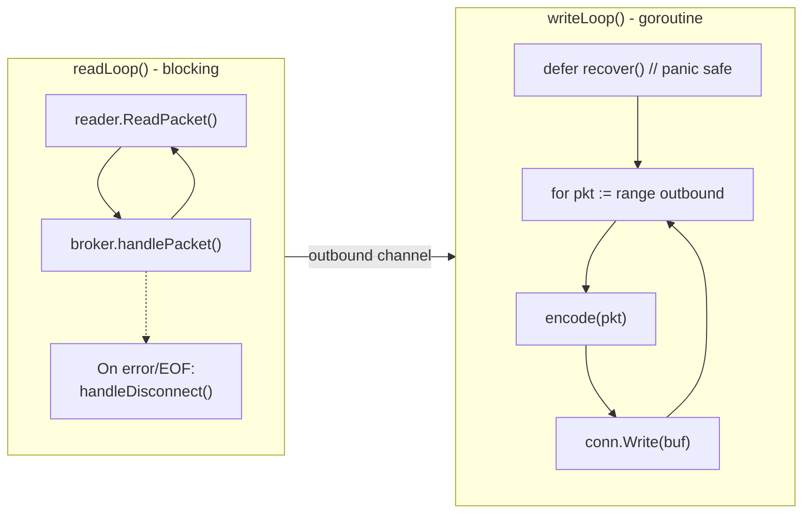

---

## Packet Processing Pipeline

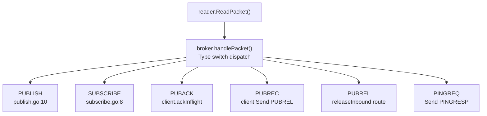

### PUBLISH Processing Flow

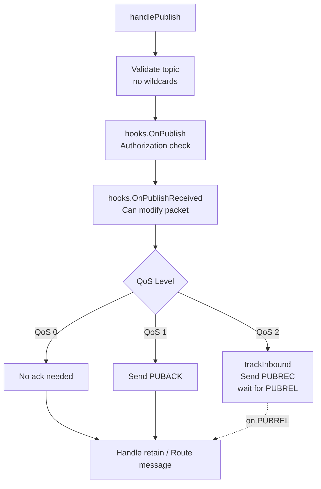

---

## Message Routing

The `routeMessage()` function (`publish.go:127`) handles message delivery to all matching subscribers:

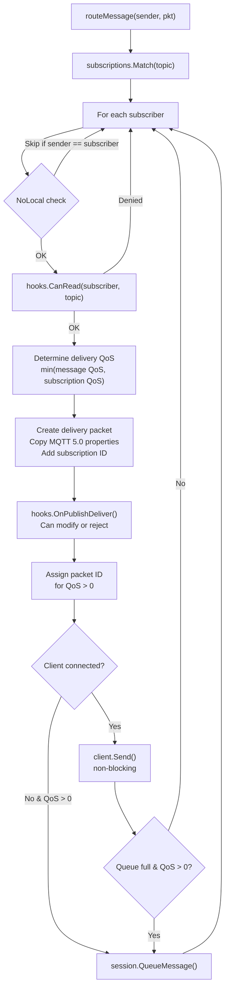

---

## Subscription Trie

The subscription tree (`subscriptions.go`) is a trie-based data structure optimized for topic matching with wildcards:

```
Example subscriptions:
  - ClientA: "home/+/temperature"
  - ClientB: "home/kitchen/#"
  - ClientC: "$share/group1/home/kitchen/temperature"

                              ┌─────────┐
                              │  root   │
                              │ trieNode│
                              └────┬────┘
                                   │
                    ┌──────────────┴──────────────┐
                    ▼                              ▼
              ┌─────────┐                    ┌─────────┐
              │ "home"  │                    │ "$share"│
              │ trieNode│                    │ trieNode│
              └────┬────┘                    └────┬────┘
                   │                              │
          ┌────────┴────────┐                     ▼
          ▼                 ▼               ┌─────────┐
    ┌─────────┐       ┌─────────┐           │"group1" │
    │   "+"   │       │"kitchen"│           │ trieNode│
    │ trieNode│       │ trieNode│           └────┬────┘
    └────┬────┘       └────┬────┘                │
         │                 │                     ▼
         ▼                 ▼               ┌─────────┐
   ┌───────────┐     ┌─────────┐           │ "home"  │
   │"temperat-"│     │   "#"   │           │ trieNode│
   │   "ure"   │     │ trieNode│           └────┬────┘
   │ trieNode  │     │         │                │
   │           │     │subscrib-│                ▼
   │subscribers│     │ers:     │           ... (continues)
   │: ClientA  │     │ ClientB │
   └───────────┘     └─────────┘
```

### trieNode Structure

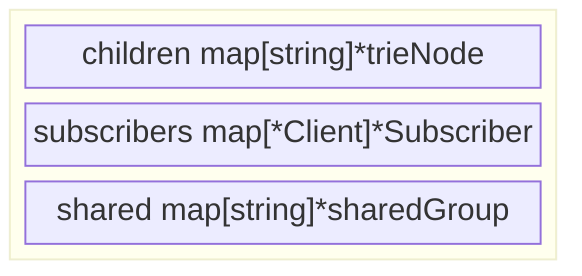

### Shared Subscription Group

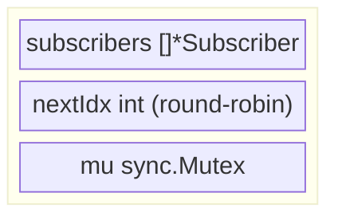

The `next()` method atomically selects `subscribers[nextIdx % len]` and increments the counter.

### Topic Matching Algorithm

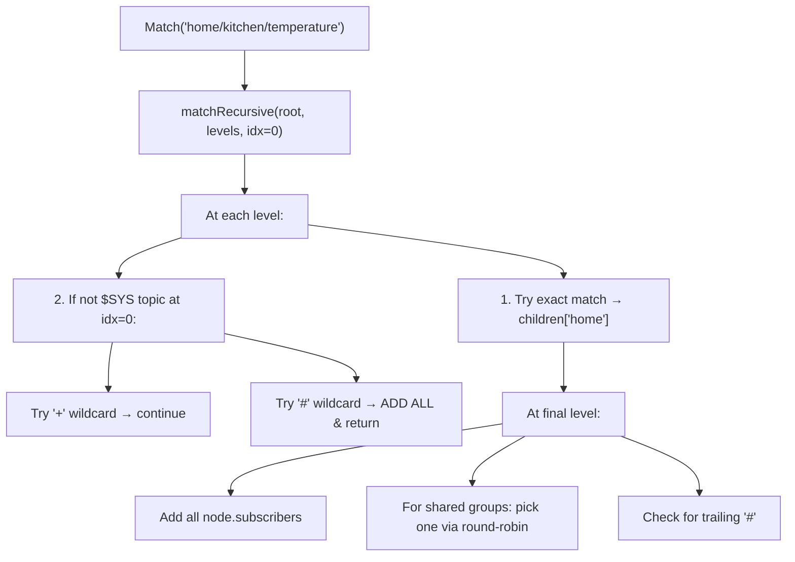

---

## Session Management

Sessions persist subscription state and queued messages across client reconnections:

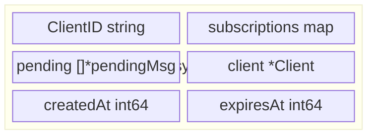

> `QueueMessage()` enforces `Config.MaxSessionQueue` limit (default: 1000)

### SessionManager

| Method | Description |
|--------|-------------|
| `Get(clientID)` | Returns existing session or nil |
| `GetOrCreate(clientID)` | Returns existing or creates new |
| `Create(clientID)` | Creates new, replacing any existing |
| `Delete(clientID)` | Removes session |
| `CleanExpired()` | Removes expired sessions |

### Session Lifecycle

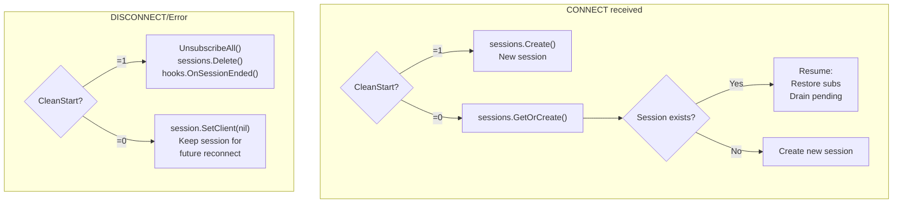

---

## QoS and Inflight Tracking

### QoS 0 (At most once)

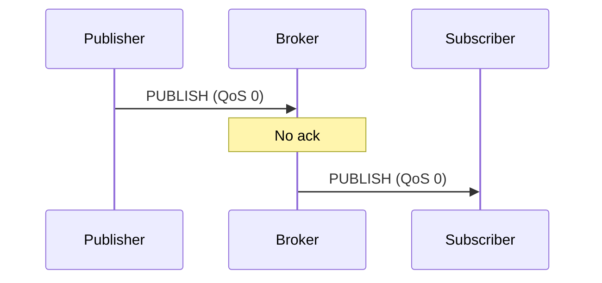

### QoS 1 (At least once)

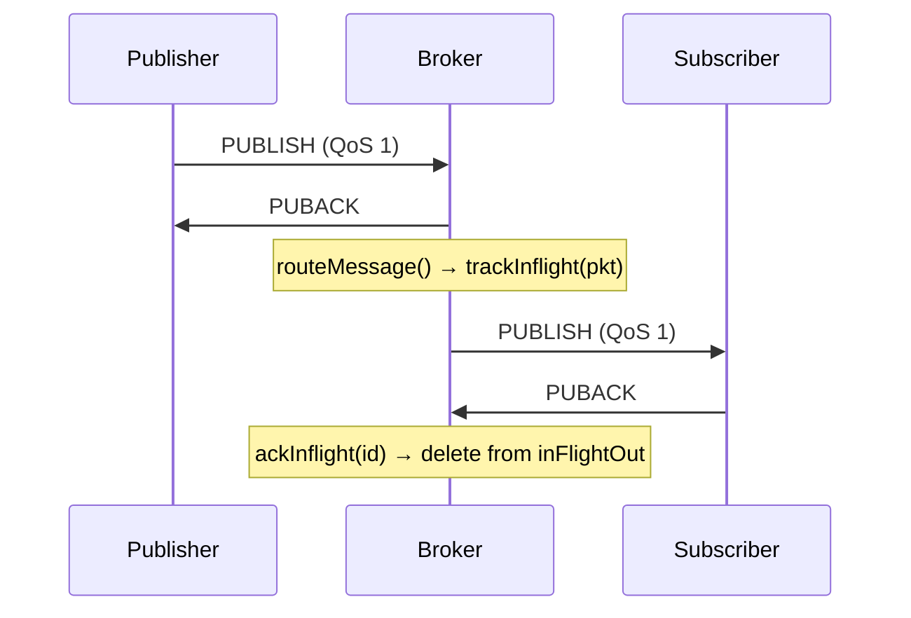

### QoS 2 (Exactly once)

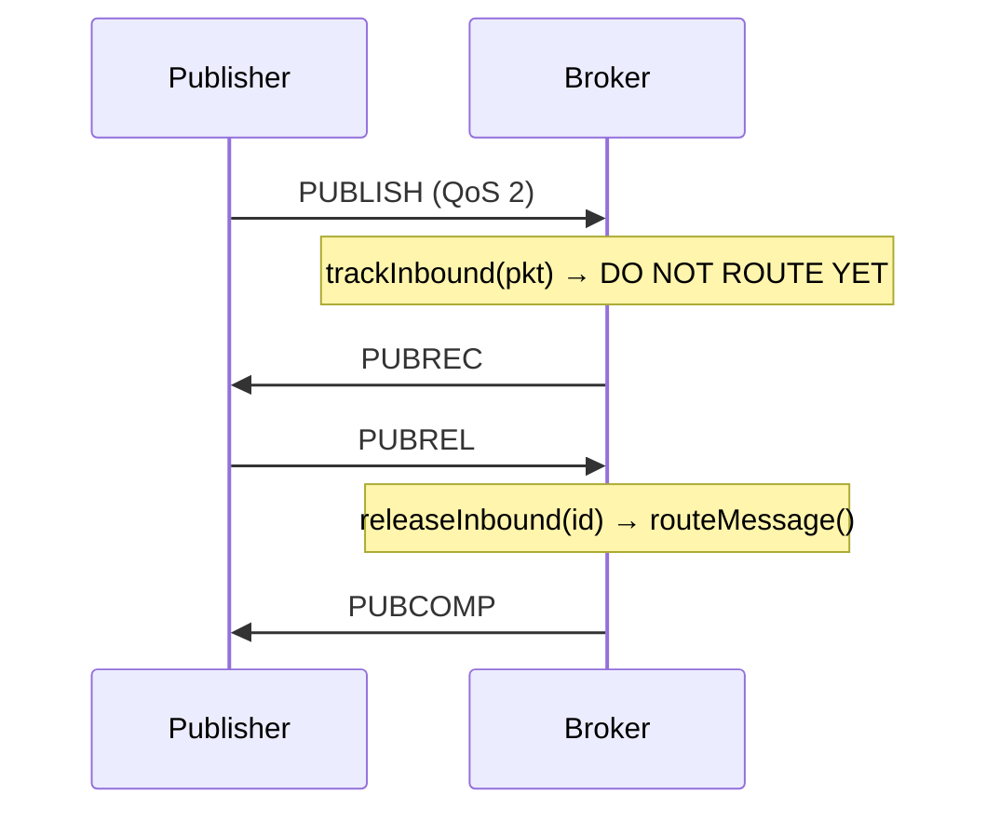

### Inflight Data Structures

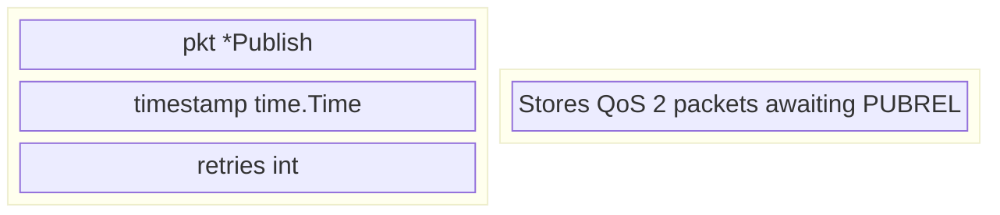

> `trackInflight()` enforces `Config.MaxInflight` limit (default: 65535). Returns false if limit reached; message queued to session instead.

---

## Retained Messages

```mermaid
flowchart TD
    subgraph Storage["Storage (retain.go:11)"]
        A["PUBLISH with Retain=1"] --> B["storeRetained(topicName, pkt)"]
        B --> C["1. Try hooks.StoreRetained()<br/>(external storage: Redis, DB)"]
        C --> D["2. If no hook → in-memory:"]
        D --> E{"len(payload) == 0?"}
        E -->|Yes| F["delete(retained, topicName)"]
        E -->|No| G["retained[topicName] = copy(pkt)"]
    end

    subgraph Retrieval["Retrieval (retain.go:37)"]
        H["SUBSCRIBE to filter"] --> I["sendRetained(client, filter, maxQoS)"]
        I --> J["1. Try hooks.GetRetained()"]
        J --> K["2. If no hook → scan in-memory:"]
        K --> L["for topicName, msg := range retained"]
        L --> M{"topic.Match(filter, topicName)?"}
        M -->|Yes| N["deliverRetained(client, msg, maxQoS)"]
        M -->|No| L
    end
```

---

## Hook System

The hook system provides extensibility points throughout the message lifecycle:

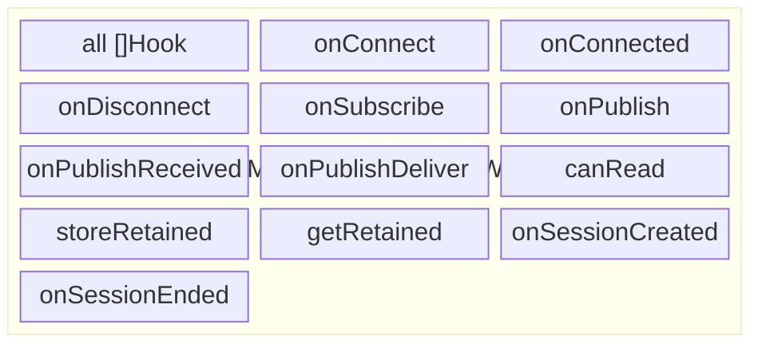

> Cached lists by event type enable fast O(1) dispatch to relevant hooks

### Hook Interface

| Method | Category | Description |
|--------|----------|-------------|
| `ID() string` | Lifecycle | Hook identifier |
| `Init(opts, config) error` | Lifecycle | Initialize hook |
| `Stop() error` | Lifecycle | Cleanup hook |
| `Provides(event byte) bool` | Lifecycle | Which events this hook handles |
| `OnConnect(ctx, client, pkt) error` | Connection | Auth, can reject |
| `OnConnected(ctx, client)` | Connection | Notification |
| `OnDisconnect(ctx, client, err)` | Connection | Notification |
| `OnSubscribe(ctx, client, subs) (subs, err)` | Authorization | Filter/reject subs |
| `OnPublish(ctx, client, pkt) error` | Authorization | Authorize publish |
| `CanRead(ctx, client, topic) bool` | Authorization | Per-message authz |
| `OnPublishReceived(ctx, client, pkt) (*pkt, err)` | Transform | Transform/drop inbound |
| `OnPublishDeliver(ctx, sub, pkt) (*pkt, err)` | Transform | Transform/drop outbound |
| `OnSessionCreated(ctx, client)` | Session | New session created |
| `OnSessionResumed(ctx, client)` | Session | Existing session resumed |
| `OnSessionEnded(ctx, clientID)` | Session | Session deleted |
| `StoreRetained(ctx, topic, pkt) error` | Retained | External storage |
| `GetRetained(ctx, filter) ([]*pkt, error)` | Retained | External retrieval |

### Hook Dispatch Patterns

| Pattern | Hooks | Behavior |
|---------|-------|----------|
| **Fail-Fast** | OnConnect, OnPublish | First error stops chain, rejects operation |
| **Transform Chain** | OnPublishReceived, OnPublishDeliver, OnSubscribe | Each hook can modify; error rejects |
| **Notify All** | OnConnected, OnDisconnect, OnSessionCreated | Fire-and-forget, no error handling |
| **First Provider** | StoreRetained, GetRetained | First hook to handle wins |
| **All Must Pass** | CanRead | Any hook can deny |

---

## Concurrency Patterns

### Mutexes (sync.RWMutex)

| Location | Mutex | Protected Data |
|----------|-------|----------------|
| `broker.go` | `clientsMu` | `clients map[string]*Client` |
| `broker.go` | `retainedMu` | `retained map[string]*Publish` |
| `session.go` | `Session.mu` | subscriptions, pending, client |
| `session.go` | `SessionMgr.mu` | sessions map |
| `subscriptions.go` | `SubTree.mu` | Entire trie structure |
| `subscriptions.go` | `sharedGroup.mu` | Round-robin index only |
| `client.go` | `packetIDMu` | nextPacketID, inFlightOut/In |
| `client.go` | `keepAliveMu` | lastActivity timestamp |
| `hooks.go` | `Hooks.mu` | All hook slices |
| `websocket.go` | `wsConn.mu` | WebSocket reader state |

### Channels

| Location | Channel | Purpose |
|----------|---------|---------|
| `client.go:37` | `outbound chan Packet` | Packet queue to writeLoop (capacity: 256, non-blocking send) |
| `listener.go:17` | `closed chan struct{}` | Signal listener shutdown |
| `websocket.go:21` | `closed chan struct{}` | Signal WebSocket listener shutdown |

### Atomics

| Location | Atomic | Purpose |
|----------|--------|---------|
| `client.go:33` | `connected Bool` | Connection state flag |
| `client.go:34` | `closed Bool` | Prevent double-close |

### Sync Primitives

| Location | Type | Purpose |
|----------|------|---------|
| `broker.go:80` | `sync.WaitGroup` | Track client goroutines |
| `listener.go:16` | `sync.WaitGroup` | Wait for accept loop exit |
| `websocket.go:20` | `sync.WaitGroup` | Wait for HTTP server exit |
| `reader.go:195` | `sync.Pool` | Buffer pool for encoding |

### Lock Granularity Design

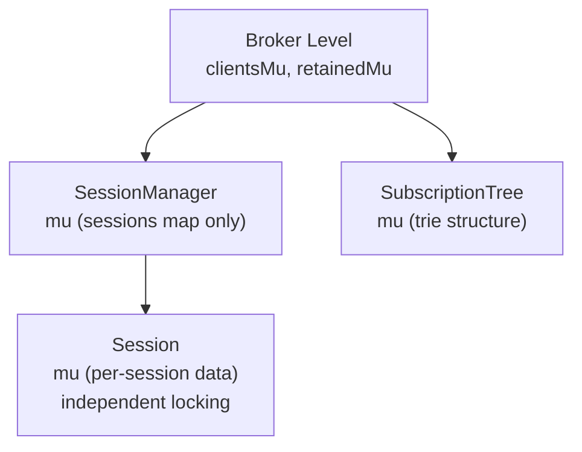

**Benefits:**
- Clients can operate independently
- Publishing doesn't block connecting
- Session access is per-client, not global
- Subscription tree has single lock but short critical sections

### Non-Blocking Send Pattern

```go
func (c *Client) Send(pkt packet.Packet) bool {
    if c.closed.Load() {          // Fast path: check atomic flag
        return false
    }

    select {
    case c.outbound <- pkt:       // Try to send
        return true
    default:                      // Channel full
        return false              // Drop (QoS 0) or queue to session
    }
}
```

This pattern ensures:
- Publishing never blocks on slow clients
- Memory is bounded (channel capacity = 256)
- QoS > 0 messages can be queued to session for retry

---

## Complete Message Flow Example

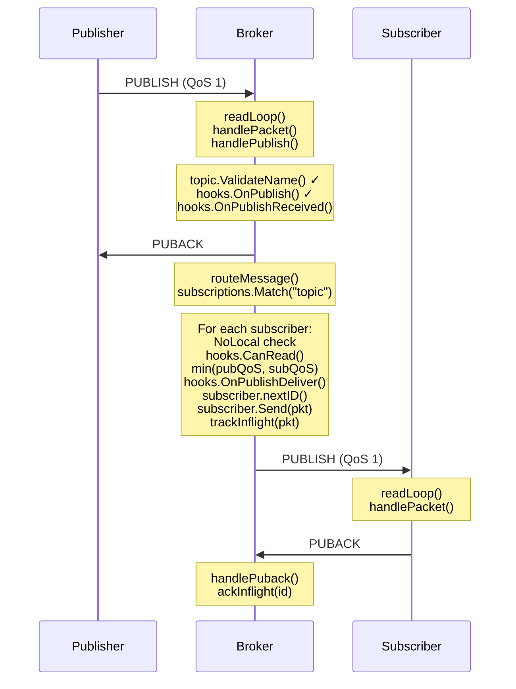

---

## File Reference

| File | Primary Responsibility |
|------|------------------------|
| `broker.go` | Core broker struct, lifecycle, connection dispatch |
| `client.go` | Client struct, read/write loops, packet ID management |
| `listener.go` | TCP/TLS listeners, Server convenience wrapper |
| `websocket.go` | WebSocket listener and net.Conn adapter |
| `connect.go` | CONNECT packet handling, session setup |
| `handlers.go` | Packet type dispatcher, PINGREQ, disconnect handling |
| `publish.go` | PUBLISH handling, QoS flows, message routing |
| `subscribe.go` | SUBSCRIBE/UNSUBSCRIBE handling |
| `subscriptions.go` | Trie-based subscription tree, wildcard matching |
| `session.go` | Session struct, SessionManager, pending messages |
| `retain.go` | Retained message storage and retrieval |
| `hook.go` | Hook interface definition, HookBase, ClientInfo |
| `hooks.go` | Hooks manager, event dispatch |
| `pkg/topic/topic.go` | Topic validation, wildcard matching, shared subs |
| `pkg/packet/reader.go` | Buffered packet reader, buffer pool |
